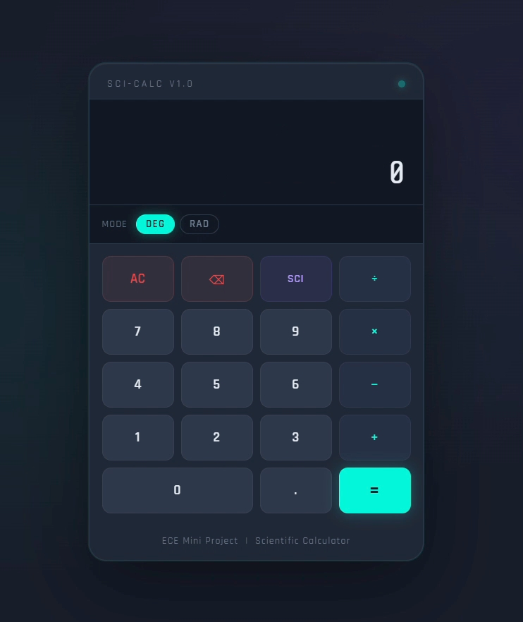

# 🧮 Scientific Calculator v1.0

> *"I'm an ECE student — but I wanted to explore software too. So I built this."*

A sleek, modern scientific calculator web application built with 
HTML, CSS, and JavaScript. Developed as an ECE Mini Project by an 
Electronics & Communication Engineering student who wanted to go 
beyond hardware and explore the world of front-end software development.

No frameworks. No libraries. Just pure HTML, CSS, and JavaScript. ⚡

---

## 📸 Preview

---

## 🚀 Demo
Simply open `index.html` in any modern web browser to start using 
the calculator. No installation required!

---

## 💡 Why I Built This

As an ECE student I work with circuits, electronics and hardware 
every day. But I always wondered — *"Can I build something on a 
screen too?"*

This project is my answer to that question. 🎯

I chose a Scientific Calculator because:
- It's a tool I actually use as an ECE student
- It covers real math — sin, cos, log, which I study in my subjects
- It helped me understand how software thinks and works
- It proved that ECE + Software = 🔥

---

## ✨ Features

- ➕ **Basic Operations** — Addition, Subtraction, Multiplication, Division
- 📐 **Scientific Functions** — sin, cos, tan, log, ln, √x
- 🔢 **Constants** — Pi (π)
- ⚡ **Exponentiation** — x^y power function
- 🔄 **Angle Modes** — Switch between DEG and RAD instantly
- 👁️ **SCI Toggle** — Show/hide scientific buttons
- ⚡ **Live Preview** — Real-time result as you type
- ⌨️ **Keyboard Support** — Full keyboard input
- 🔧 **Auto-close Parentheses** — Automatically closes open brackets
- ❌ **Error Handling** — Clean error display for invalid expressions

---

## 🛠️ Getting Started

**No installation. No setup. Just open and use.**

1. Download or clone this repository
2. Open `index.html` in Chrome, Firefox, or any modern browser
3. Start calculating! ✅

---

## 📖 How to Use

1. Open `index.html` in your browser
2. Click buttons or use your keyboard to type expressions
3. Press `=` or `Enter` to calculate
4. Click **SCI** to toggle scientific functions
5. Switch **DEG/RAD** for trigonometric calculations

### ⌨️ Keyboard Shortcuts

| Key | Action |
|-----|--------|
| `0–9` | Numbers |
| `+` `-` `*` `/` | Operators |
| `.` | Decimal |
| `(` `)` | Parentheses |
| `^` | Power |
| `Enter` or `=` | Calculate |
| `Backspace` | Delete |
| `Escape` | Clear all |

### 🧪 Example Calculations

| Expression | Result |
|-----------|--------|
| `2 + 3 * 4` | `14` |
| `sin(30)` in DEG | `0.5` |
| `sqrt(16) + log(100)` | `6` |
| `2^8` | `256` |

---

## 🏗️ Project Structure
scientific-calculator/
├── index.html         → Structure & button layout
├── style.css          → Dark theme, animations, CSS Grid
├── script.js          → All calculator logic & math evaluation
├── calculator-preview.png  → Calculator screenshot
└── README.md          → Project documentation
---

## 🛠️ Technologies Used

| Technology | Purpose |
|-----------|---------|
| **HTML5** | Structure and button layout |
| **CSS3** | Dark theme, CSS Grid, animations |
| **JavaScript ES6+** | Math logic, DOM manipulation, events |
| **Google Fonts** | Share Tech Mono + Rajdhani |

---

## 🌐 Browser Compatibility

Works on all modern browsers:
- ✅ Chrome 60+
- ✅ Firefox 55+
- ✅ Safari 11+
- ✅ Edge 79+

---

## 🎓 What I Learned

This was my first software project as an ECE student. Through 
building this I learned:

- How HTML, CSS and JavaScript work together as a team
- CSS Grid layout for building structured button grids
- JavaScript DOM manipulation to update the display
- How to safely evaluate math expressions in JavaScript
- Event handling for both click and keyboard input
- How to deploy a project and maintain it on GitHub

---

## 🔭 Future Scope

- 📊 Graph plotter for functions like sin(x), cos(x)
- 🔁 Calculation history panel
- ⚡ Electrical unit converter for ECE students
- 📱 Mobile app using PWA
- 🧮 Matrix calculator for ECE subjects

---

## 👩‍💻 Author

**Shaik Rafiya Kousar**
Electronics & Communication Engineering Student
Narayana Engineering College, Nellore

*Built with ❤️ as an ECE Mini Project —
and a lot of curiosity about software!* 🚀

---

## 📄 License

This project is open source and available for 
educational purposes. Feel free to use and 
modify for learning!
